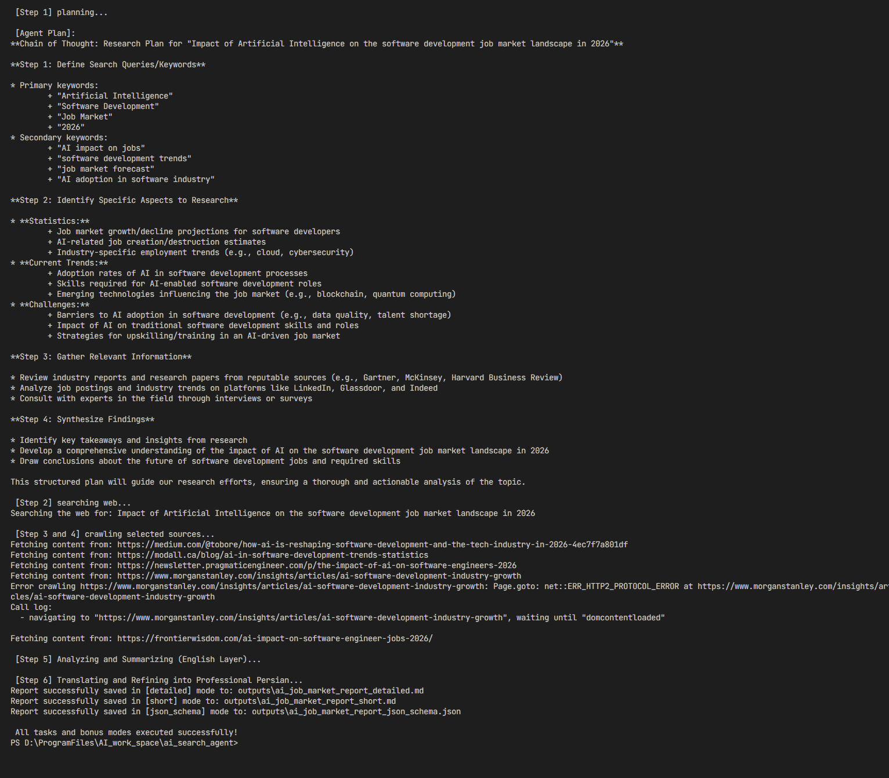
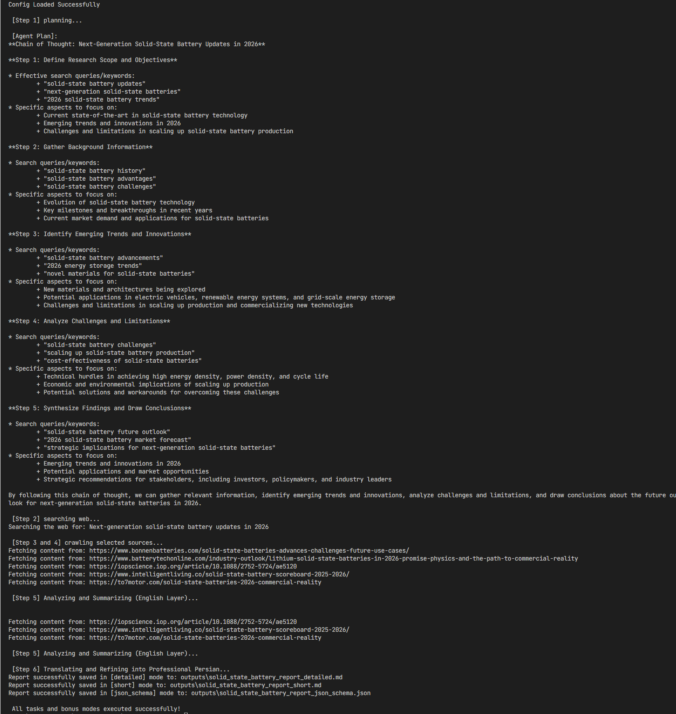

# Autonomous AI Agent for Web Search & Summarization

### A resilient, production-ready autonomous research agent designed to orchestrate automated web searches, deep page crawling, and semantic reasoning using a local Large Language Model (LLM via Ollama). The system utilizes a precise Chain-of-Thought (CoT) pipeline to transform broad research inquiries into highly verified, multi-format analytical reports.

---

## 🏗️ Project Architecture & Component Structure

``` structure 
├── agent/
│   ├── __init__.py          # Marks directory as a Python sub-package
│   ├── orchestrator.py      # Single-agent loop control & sequential tool orchestration
│   └── prompts.py           # Structured systemic instructions & reasoning frames
├── tools/
│   ├── __init__.py          # Marks directory as a Python sub-package
│   ├── search_tool.py       # WebSearchTool with dynamic ranking & scratchpad
│   └── crawler_tool.py      # Core content scraper and extractor
├── tests/
│   ├── __init__.py          # Marks directory as a Python sub-package
│   └── test_agent.py        # Automated test suites for validation
├── config.py                # Global hyperparameters & model configurations
├── .env.example             # Template for localized environment variables
├── .gitignore               # Strict exclusion matrix for local cache & secrets
├── main.py                  # Entry-point and multi-format pipeline exporter
├── outputs/                 # Stored artifacts & execution timeline visuals
├── Dockerfile               # Containerization blueprint for the Python application
├── docker-compose.yml       # Multi-container orchestration (Agent + Ollama Healthcheck)
├── requirements.txt         # Core production and development dependencies
└── README.md                # System documentation & architectural blueprint
```

## 🧠 Architecture Choices & Why They Matter

* **LangChain / LCEL Integration:** We used LangChain to build a clean, predictable pipeline. This keeps the agent's step-by-step reasoning completely separate from the actual tools it runs, making the code much easier to maintain.
* **Local LLM with Ollama:** Running the model locally ensures 100% data privacy and zero API costs. We set the model's `temperature` to a very low `0.1` to keep responses precise, factual, and stable during translation.
* **Two-Step Data Verification:** 
  * *Web Search + Scraper:* Instead of just reading short search snippets, the agent goes a step further and crawls the actual text inside the web pages.
  * *Quality Ranking Engine:* It filters out bad links using a trusted domain list (like Wikipedia or arXiv) and prioritizes long, high-quality articles with the most up-to-date data.
* **Short-Term Scratchpad Memory:** The agent keeps a live log of its internal actions. This prevents the system from being a "black box" and lets you see exactly how it searches and filters information in real-time.
 
## ⚙️ Production Deployment & Execution

### Environment Provisioning

Before booting the system, copy the environment template and initialize your localized variables:

```bash 
cp .env.example .env
```

### Option 1: Local Deployment
Ensure your local model provider (e.g., Ollama) is actively listening on your host engine before initiating the lifecycle.

```bash 
# 1. Install localized dependencies cleanly
pip install -r requirements.txt

# 2. Run the automated testing suite
pytest tests/test_agent.py

# 3. Launch the central orchestrator
python main.py

```

### Option 2: Docker Containerization (with Docker Compose)
For absolute environment parity and persistent volume mapping, spin up the stack via Docker:

```bash 
# Run the entire automated multi-format research pipeline
docker compose up --build
```

## 📸 Execution Timelines & Verification Logs

### To verify the autonomous execution flow and tool interactions on a fully local infrastructure, a complete continuous timeline of the system run has been captured below:

#### 1. Topic A: Software Development Job Market Landscape (2026)
<br>

<br>

#### 2. Topic B: Next-Generation Solid-State Batteries (2026)
<br>

<br>

## 📁 Output Artifacts & Enterprise Schema

To accommodate different use cases, the agent splits its findings into three distinct files inside the `/outputs` directory for every topic processed:

* **Detailed Report (`*_detailed.md`):** A deep-dive Markdown document containing the complete analysis, verified sources with access logs, the agent's full Chain of Thought (CoT), and the internal tool scratchpad history.

* **Executive Summary (`*_short.md`):** A brief, high-level summary optimized for quick reading and immediate takeaways, restricted to key analytical insights.

* **Structured Data (`*_json_schema.json`):** A fully valid JSON file matching the modern JSON Schema standard (Draft 2020-12), including explicit execution metadata. Perfect for automated ingestion into databases or analytics dashboards.

### 📊 Note: For the required sample reports covering both separate research topics, please explore the contents of the /outputs directory included within this submission payload.
